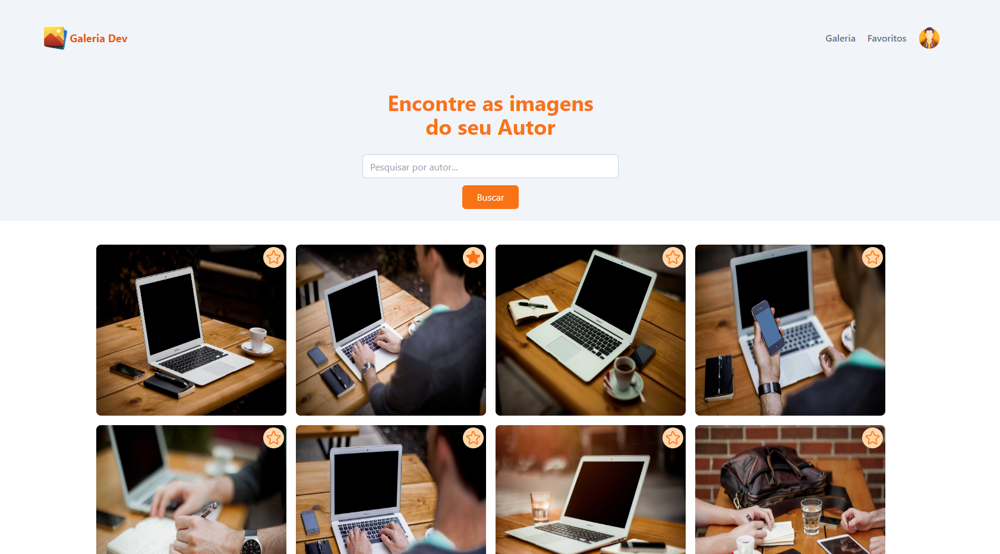

# Projeto: Galeria Dev

O Galeria Dev é um dos projetos feito para concorrer a uma vaga de dev frontend na comunidade Frontend Fusion.
O objetivo foi montar uma página que consulte uma API e exiba as imagens contidas na mesma.





## Tecnologias Utilizadas

- Vite: Ferramenta de build para um ambiente de desenvolvimento rápido e eficiente.
- React: Biblioteca JavaScript para criação da interface do usuário.
- Tailwind: Framework CSS para estilização da página.
- Phosphor icons: Ícones utilizados na página.
- API: Consumo de imagens e apresentação na galeria.
- Local Storage: Armazenamento de imagens favoritas.


## Estrutura da Página

- Galeria: Exibe todas as fotos disponíveis na API.
- Favoritos: Exibe as imagens marcadas como favoritas.
- Buscar : Exime as imagens do autor digitado.
- Icone Favoritar: Permite marcar/desmarcar fotos como favoritas.
- Clicando na Foto: Visualiza as informações adicionais da mesma.
 

## Como Executar o Projeto
1. Clone o repositório:

   ```bash
   git clone https://github.com/DevTec2020/GaleriaDev.git
   ```

3. Instale as dependências::

   ```bash
   npm install
   ```
  
4. Inicie o servidor de desenvolvimento:

   ```bash
   npm run dev
   ```
